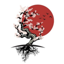

  

<h1 align="center">Hi 👋, I'm Enes 🔹</h1>
<h3 align="center">🚀 CS Student @ UTM • Founder of Shinka • iOS + Flutter + Full-Stack • AI Tinkerer</h3>

  <i>"Life is not a problem to be solved, but a reality to be experienced."</i>

  
  

---

## 👨‍💻 About Me

- 🎓 CS student @ **UTM**, exploring the seam between software, design, and AI
- 🛠️ Currently shipping **Mizan** (iOS prayer companion, final push to the App Store), **MoshiMosh** (Japanese learning), **Pocket** (indie-maker finance OS), and **GymVro** (pastel pocket gym)
- 🏪 Running **Hit & Go**: a web studio crafting premium sites for local GTA businesses, first clients signed
- 📱 Native iOS in **SwiftUI**, cross-platform in **Flutter** + **React Native**, web in **Next.js**
- 🤖 Agentic engineering with **Claude Code**: multi-agent fleets, custom skills, MCP servers, Telegram-bot automations
- 🐧 Daily driver of **Arch Linux + Hyprland**, terminal-first, dotfile-obsessed
- 🎯 Goal: ship real products that solve real problems for real people

---

## 🧰 Tech Stack

### 🔹 Languages

  
  
  
  
  
  

### 🔹 Mobile

  
  
  
  
  
  

### 🔹 Frontend

  
  
  
  
  
  
  

### 🔹 Backend & Data

  
  
  
  
  
  

### 🔹 DevOps & Tools

  
  
  
  
  
  
  

### 🔹 AI & Automation
- Agentic engineering with **Claude Code** + the **Anthropic SDK**: multi-agent fleets, custom skills, and **MCP** servers (including a code-graph memory indexed over my repos)
- A small **Telegram bot fleet** for idea capture and tool discovery: deterministic Python transports, LLM brains
- Voice generation via **ElevenLabs** with content-addressable audio hosting on **Cloudflare R2**
- Local-first LLM workflows with self-hosted **Ollama**

---

## 🚧 Featured Projects

###  **Mizan** · *Privacy-first Muslim prayer companion (SwiftUI)*

> Built ground-up in SwiftUI with **zero third-party SDKs**. Fully offline, bilingual (EN + TR), no accounts, no tracking, no ads. Final push to the App Store.

- ⏱️ Live prayer-time countdown with arc-progress ring and **forbidden-time windows** (Fajr/Asr)
- 🔴 Prayer **Live Activities**: a lock-screen countdown that arms near prayer time and bows out after the adhan
- 🕌 Interactive **3D prayer & wudu demonstrator** with skinned characters and staged step-by-step transitions
- 🧭 Magnetometer-backed **Qibla compass** with Kaaba marker + distance to Makkah
- 📖 Full **114-surah Quran reader** (Arabic + transliteration + English) with verse-by-verse recitation audio and persistent bookmarks
- 📿 Tasbih, **Umm al-Qura** Hijri calendar, hadith, memorization, journal, stats: 240+ Swift files across 21 feature folders · built with XcodeGen

  
  
  
  
  

---

###  **MoshiMosh** · *Production Japanese learning app with leagues + real-time social*

> A gamified learning platform with progression, competition, and live social: built for daily use, not toy demos.

- 🇯🇵 Adaptive **Kanji ↔ Kana ↔ Romaji** rendering tuned to user reading preference
- 🎮 **Match Madness** + **Careless Maniac** mini-games + **Memory-Weave** personal mnemonics
- 🏆 Weekly competitive **leagues** with promotion/demotion + real-time chat & leaderboards
- 🔊 Content-addressable audio pipeline: ElevenLabs voice → SHA-256 → Cloudflare R2 CDN
- 💎 Subscription via **RevenueCat** (Shinka Plus) · ~98 Dart files across 45 screens

  
  
  
  
  
  
  

---

###  **Pocket** · *Financial OS for indie makers and creators*

> The dashboard I wished existed when I started shipping things. Money + audience + AI advice, all in one place.

- 📊 Multi-project **budget tracking** with timeline + grid views and pinned favorites
- 💳 **Stripe** + **RevenueCat** revenue ingestion side-by-side with expenses
- 📈 Instagram / YouTube / TikTok metrics aggregated next to your finances
- 🤖 **Claude-powered financial agent** that reads your real entries to give contextual advice
- ⚡ ~147 TS files · NativeWind NEO design system · TanStack Query for cache patterns

  
  
  
  
  
  
  

---

###  **Snag** · *Self-hosted media downloader, three destinations*

> Paste a URL → pick a destination → stream the file. No public services, no leaks, runs on my own machine.

- 🔗 Paste any **yt-dlp**-supported URL → route to local folder, Google Drive, or remote machine via SFTP
- 🔐 **TOTP 2FA** layered on top of Cloudflare Access (defense-in-depth)
- 🛡️ **Fernet-encrypted** credentials at rest (Drive refresh tokens, SSH private keys)
- 📱 **PWA shell** with offline fallback + installable home-screen icon
- ⚙️ Auto-starts via launchd, exposed safely over **Cloudflare Tunnel** (no port forwarding)

  
  
  
  
  
  
  

---

###  [**Portfolio · shinka.ca**](https://shinka.ca) · *Personal site, designed like software*

> Not a CV. A piece of software you visit.

- ✍️ Self-writing **進化 calligraphy** title, sakura cursor trail, and a Rive balloon drifting through the hero
- 🌗 Three themes (light · midnight · sepia) with `prefers-color-scheme` detection
- 🇯🇵 Bilingual **EN / 日本語** content via next-intl with locale-aware routing
- 🎬 **GSAP** + **Framer Motion** choreography on every section
- 🎮 Hidden easter eggs, including a full canvas **Connect Four** (465 lines of game logic)
- ⚖️ A `/legal` hub serving branded privacy + terms pages for every Shinka app
- 🚀 Static export, deployed via **Cloudflare Pages**

  
  
  
  
  
  
  

---

###  **GymVro** · *Your pastel pocket gym: train, eat, streak, beat the boss*

> A cozy, kawaii-styled fitness companion that turns consistency into a game you want to keep playing.

- 💪 **Gym Mode** set-by-set logging with muscle-group focus chips and a weekly "vs last week" volume trend
- 🍜 Food scanning + live nutrition, recipes, and exercises from free public APIs, each cached with graceful offline fallback
- 🔥 Streaks, achievements, personal records, and a **boss battle** that only takes damage when you show up
- 👥 Real-time **Squads** social layer with email / Google / Apple auth on Firebase
- 🎨 Semantic pastel design system with a custom `Gv*` component library, six swappable themes, zero hardcoded colors
- 🧪 **496 tests** across 88 files, `flutter analyze` clean

  
  
  
  
  

---

## 🧪 Also on the bench

- 🕶️ **Immersa** · iOS app that turns Insta360 360° shots into navigable virtual tours (SwiftUI + SceneKit + SwiftData)
- 📸 **Lumette** · a disposable camera for any event: guests scan a QR, shoot a few frames, nobody sees the photos until the host reveals the album
- 👷 **Foreman** · native iOS construction project management: projects, crew, costs, receipt OCR, and an insight/report engine
- 🖊️ **OpenBoard** · a whiteboard app by Shinka, built on the open-source Excalidraw editor
- 🎬 **Jarvis** · AI video editor: clips + music in, a beat-synced captioned 9:16 short out (FFmpeg renderer, Claude planner/critic)

---

## 🐍 Watch the snake eat my contributions

<picture>
  <source media="(prefers-color-scheme: dark)" srcset="https://raw.githubusercontent.com/KaosFish/KaosFish/output/github-contribution-grid-snake-dark.svg"/>
  <source media="(prefers-color-scheme: light)" srcset="https://raw.githubusercontent.com/KaosFish/KaosFish/output/github-contribution-grid-snake.svg"/>
  
</picture>

---

  <b>My system after <code>rm -rf</code></b> 
  

